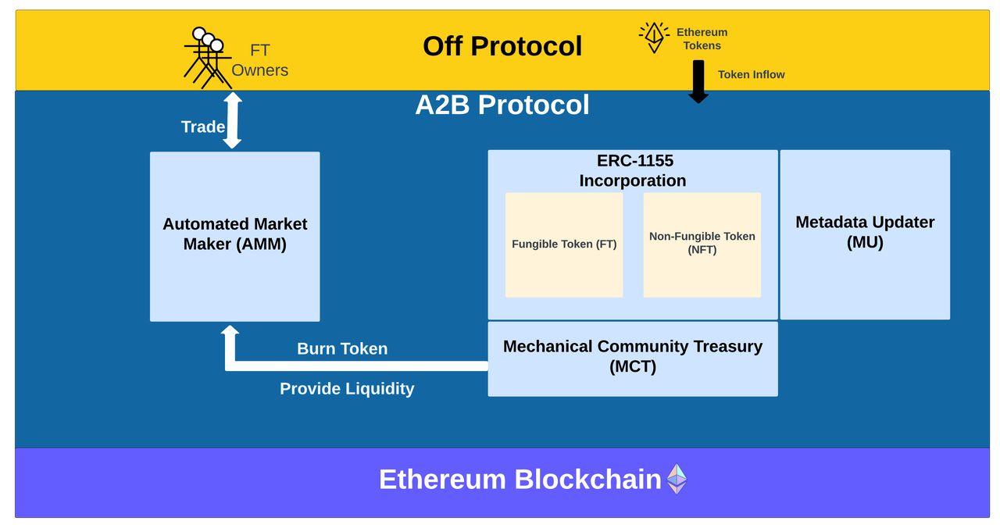
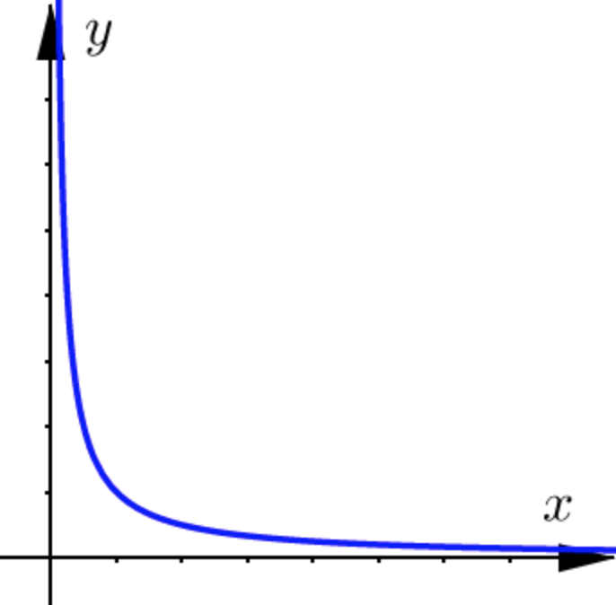

# A2B protocol White Paper - v0.1

## Introduction

The A2B protocol is a **decentralized non-fungible token (NFT) finance** protocol that routes revenue generated from NFTs. This protocol operates on the application layer and is built on top of the Ethereum network.

Currently, three well-known protocols, ERC-20, ERC-721, and ERC-1155, form the blockchain economy based on the exchange and valuation of either fungible or non-fungible tokens individually. However, the A2B protocol is the first to establish a dynamic blockchain economy by combining fungible and non-fungible tokens through automatic procedures.

The dynamic blockchain economy established by the A2B protocol is composed of three crucial components:

1.  ERC-1155 Incorporation: This allows A2B protocol to integrate seemlessly into existing ecosystem, and easily supported both fungible token and non-fungible token. 
2.  Automated Market Maker (AMM): This allows market participants and fungible token (FT) holders to trade FTs efficiently. Anyone who owns FTs can provide liquidity to the liquidity pool that is generated along with contract creation.
3.  Metadata Updater (MU): This provides NFT owners the ability to update the metadata of their NFT, encouraging creativity and personalization. This also makes NFT ownership resemble physical object ownership, where the owner has control over their subjects.



This document presents the components and mechanisms of the A2B protocol and how it creates a new dynamic token economy. Simplified code blocks are included in various sections for illustration purpose. Additionally, this white paper includes examples of use cases that can benefit from the protocol in the dynamic token economy.

## ERC 1155 Incorporation

The A2B protocol leverages the ERC-1155 standard, which efficiently manages both fungible (ERC-20) and non-fungible (ERC-721) tokens within a single smart contract. Compared to ERC-20 and ERC-721, ERC-1155 offers better efficiency in terms of data size, latency, and contract creation and token transfer costs.

By supporting ERC-1155, the A2B protocol can use both fungible and non-fungible tokens as fundamental building blocks to create a dynamic token economy. Additionally, it enables easy integration of fungible tokens and non-fungible tokens created through the A2B protocol with existing exchanges.

### Mint Fungible Token

In the A2B smart contract, the owner has the authority to mint the fungible token. The total supply of these tokens is predetermined as a basic parameter of the contract. To mint new tokens, the contract owner must create a Mint Notice (MT) specifying the amount of tokens to be minted and the MT's mature date. The A2B protocol requires all mature dates to be at least 7 days (604,800,000 milliseconds) in the future. Once an MT reaches maturity, it is automatically executed, and the newly minted fungible tokens are added to the owner's address. The owner can also cancel an MT before it reaches maturity.

Each MT also follows the A2B protocol's basic rules,

- sum of MT fungible token amount, current circulating fungible token amount, and burned fungible token amount cannot exceed the total supply of fungible token amount defined in the smart contract
- MT fungible token amount must be less than 10%* of the current circulating amount

Note that the requirement of mature date and restriction on MT fungible token amount can be changed by A2B DAO.

### NFT Revenue Routing

Under the A2B smart contract, NFT controls revenue inflow. Every time an NFT is minted in an A2B smart contract, an address known as the **NFT Token Buffer (NTB)** is established alongside the NFT. The NTB is created at the time of NFT creation with no initial token quantity and can only be linked to a single NFT. The relationship between an NFT and its associated NTB is enforced through a one-to-one mapping at the protocol level of the A2B.

```
mapping(uint256 => address) nft_to_ntb;
mapping(address => uint256) ntb_to_nft;
mapping(uint256 => uint8) ntb_distribution_factor; // [0, 100]

function _initialize_ntb(uint256 nft_id, uint256 distribution_factor) private {
    require(distribution_factor >= 0 && distribution_factor <= 100, "distribution factor is out of range");

    address ntb_address = _generate_address();
    nft_to_ntb[nft_id] = ntb_address;
    ntb_to_nft[ntb_address] = nft_id;
    ntb_distribution_factor[nft_id] = distribution_factor;
}
```

Revenue enters a specific NFT Token Buffer (NTB) under two scenarios,

- A NFT is transferred from one address to another address, and there's a fee (ex. royalties) collected by the NFT's creator, a portion of that fee will be sent to this NFT's corresponding NTB
- A third party directly sends tokens to a NFT's corresponding NTB

#### Scenario I

The `transferFrom` function, consistent with the ERC-721 and ERC-1155 standards, is utilized to move the NFT from the sender's address to the receiver's address. In addition, a fee is reserved as royalties for the creator of the NFT. A portion of the fee is then routed to the NFT Token Buffer, based on a fixed distribution factor that is set by the smart contract owner at the time of NFT and NTB creation. The distribution factor, a value ranging from 0 to 100, inclusive, determines the proportion of the fee that goes into the NFT Token Buffer.

```
function transferFrom(address _from, address _to, uint256 _nft_id, uint256 total_fee) public {
    uint256 ntb_distribution_fee = total_fee * ntb_distribution_factor[_nft_id];
    uint256 remaining_owner_fee = total_fee - ntb_distribution_fee;

    _transfer_nft(_from, _to, _nft_id);
    _send(nft_to_ntb[_nft_id], ntb_distribution_fee);
    _send(contract_owner, remaining_owner_fee)
}
```

#### Scenario II

A `sendToNFT` function is used to allow third parties to directly send tokens into the NTB associated with a certain NFT. A third party can be another on chain address, or an off chain party integrated with A2B protocol.

```
function sendToNFT(uint256 _nft_id, uint256 fee) public {
    require(fee > 0, "fee needs to be greater than 0");
    require(nft_to_ntb[_nft_id] != address(0), "token pool does not exist yet");
    _send(nft_to_ntb[_nft_id], fee);
}
```

A NTB doesn't hold any token. Once tokens reached a NTB, they are routed directly to the contract's corresponding AMM to swap for contract's own fungible token. This in will increase the Ethereum balance in liquidity pool, and provide better liquidity for the fungible token.

```
event NtpSwap(uint256 nft_id, uint256 amount);

function _ntbSwap(uint256 nft_id, uint256 ethAmount) public {
    require(ethAmount > 0, "ethAmount needs to be greater than 0");
    require(nft_to_ntb[_nft_id] != address(0), "token pool does not exist yet");
    swap(0x0, false, ethAmount); // swaping ETH for contract's fungible token, and burn the swapped token
    emit NtpSwap(nft_id, ethAmount); // broadcast the swap event
}
```

## Automated Market Maker (AMM)

The A2B protocol features an Automated Market Maker (AMM), which is a decentralized exchange that enables the trading of assets on-chain. This exchange is specifically designed for trading the fungible tokens within the A2B protocol. When a smart contract is created in A2B, a corresponding exchange between the fungible tokens and ETH is established using the A2B factory/registry contract.

The exchange is maintained by a liquidity pool holding both the fungible tokens and ETH, and by an invariance algorithm that ensures the balance between the two assets in the pool remains consistent. This relationship can be represented mathematically by the equation y = 1/x, which can be visualized in a graph as below.



Initially, the exchange has no liquidity, but anyone who holds the fungible tokens of the contract can add liquidity by depositing both ETH and FTs into the pool. The first liquidity provider determines the exchange rate based on the ratio of ETH and FTs they deposit. Liquidity can also be withdrawn by liquidity providers at the current exchange rate.

Liquidity providers in an A2B exchange receive liquidity tokens to represent their contributions, and they receive 0.25% of the total transaction amount as reward.

## Metadata Updater (MU)

When a new NFT is created in an A2B smart contract, it's accompanied by a file containing its genesis metadata that is stored on a decentralized file storage network. Unlike regular ERC-1155 or ERC-721 protocols, A2B provides a mechanism for updating the metadata associated with a specific NFT, which makes the NFT dynamic and opens up countless possibilities.

### Metadata

Metadata stores the essential information of associated NFT, like attributes, media url, interactions, etc. And they are stored in a decentralized storage network (e.g. InterPlanetary File System aka IPFS).

When there's a need to update a NFT, a new metadata file is generated, processed, and verified off Ethereum network, then stored into the IPFS. After that, this new metadata file will be associated with corresponding NFT through A2B contract's update method. The history of NFT metadata updates can be tracked through emitted MetadataUpdate events preferably. Since the parent of the updated NFT is tracked inside the contract, the update history can also be read from the contract by recursively reading the parent of the NFT.

```
mapping(uint256 => string) private _internal_token_id_to_metadata_uri;
mapping(uint256 => uint256) private _external_token_id_to_internal_token_id;
mapping(uint256 => address) external_token_id_to_owners;
uint256 current_external_token_id;
uint256 current_internal_token_id;
mapping(uint256 => uin256) private _internal_token_id_to_parent_internal_token_id;

event MetadataUpdate(address indexed owner, uint256 indexed token_id, uint256 indexed parent_internal_token_id, string indexed parent_uri);

function update(uint256 token_id, uint256 updated_Metadata_uri) { // token_id refers to external_token_id in an A2B contract
    require(_exists(token_id), "A2B: token update for nonexistent token");
    require(msg.sender == external_token_id_to_owners[token_id]), "A2B: only token owner can update";
    string parent_internal_token_id = _external_token_id_to_internal_token_id[token_id]
    string parent_uri = _internal_token_id_to_metadata_uri[parent_internal_token_id];

    new_internal_token_id = current_internal_token_id + 1;
    current_internal_token_id = current_internal_token_id + 1;

    _internal_token_id_to_metadata_uri[new_internal_token_id] = updated_metadata_uri;
    _internal_token_id_to_parent_internal_token_id[new_internal_token_id] = parent_internal_token_id;
    _external_token_id_to_internal_token_id[tokenId] = current_internal_token_id;

    emit MetadataUpdate(msg.sender, token_id, parent_internal_token_id, parent_uri); // can easily retrieve previous metadata
}
```

## Fee Structure

When an A2B smart contract is created, the contract creator must pay a gas fee, but no additional fees are required for creating new contracts. Once the accumulated NTB routed amount exceeds 10 ETH, the A2B protocol will charge fees for following event,

- 0.5% of the amount of every NTB swap event

- 5% of the total amount on every newly minted fungible token

As discussed in the AMM section, there is also a 0.25% fee for all AMM transactions. Of this fee, 80% is distributed to liquidity pool providers and the remaining 20% goes to the A2B protocol.

It's important to note that the percentage of all these fees is subject to change by A2B DAO.

## Examples

The possibilities for using A2B protocol are vast. Following are examples to illustrate the general philosophy.

### Ariel (Artist)

Ariel is a digital artist who sells artwork as NFTs, and also has a loyal fan base.

#### Onboarding

After Ariel joins the A2B protocol, she can mint her own fungible tokens (FTs), and her new non-fungible tokens (NFTs) will be created under A2B protocol. To support her, Ariel's fans become owners of her FTs. Ariel sets a parameter for each of her NFTs which determine the amount of revenue to be distributed to the NFT token Buffer (NTB) royalties. Ariel also establishes a threshold for her NTB. A decentralized exchange is created for Ariel's FTs through her A2B smart contract, and she provides the initial liquidity for the exchange. Her fans then followed suit.

#### Revenue Routing

When Ariel's NFTs are traded and generate royalties, a predetermined portion of the royalties is directed towards the NFT Token Buffer (NTB), then routed to the AMM to swap Ariel's FTs. The more FTs a holder has, the more appreciation they will receive.

#### Decentralized Token Exchange

As Ariel gains popularity, her artworks become more valuable and generate more royalties. This results in the appreciation of her FTs, providing financial rewards for her dedicated fans who trade them on the exchange created through the A2B protocol.

#### Metadata Updater

Olivia, one of Ariel's fans, can purchase Ariel's NFTs and add her own touch to them using MU. The original version can still be accessed by tracing the history of the NFT.

### Ryan (Musician)

Ryan, an indie musician, has seen widespread adoption of his music as background music for short videos on platforms such as Tiktok, Instagram, and Youtube.

#### Onboarding

Upon joining the A2B protocol, Ryan turns his music into NFTs and receives revenue from platforms when his music is used in short videos. Ryan also creates FTs for fans who appreciate his music and believe in his future success.

#### Revenue Routing

When Ryan earns revenue, a predefined portion is directed to his NTBs, and then routed to swap corresponding FTs.

#### Decentralized Token Exchange

Ryan's fans trade his FTs on the exchange. As his music gains popularity and is featured in more short videos, more revenue is directed into AMM to add liquidity for his FTs, making Ryan's FTs more valuable and providing benefits for both Ryan and his fans. This, in turn, helps drive the growth of Ryan's music and enhances his image as a musician.

### Ada (Freelancer)

Ada is a freelancing software developer working on various blockchain projects.

#### Onboarding

When Ada joins the A2B protocol, she first generates NFTs as certificates of her revenue from each project she works on. Then Ada sets a ratio on each of her NFTs. These ratios represent the percentage of income that Ada is willing to direct to NTBs. Ada's followers, who trust in her expertise and project selections, become her FT holders. The A2B smart contract opens a decentralized exchange for Ada's FTs, allowing her followers to trade them.

#### Revenue Routing

When Ada earns money from her blockchain projects, as represented by her NFTs, a pre-determined portion of each revenue will be redirected to add liquidity for corresponding liquidity pool.

#### Decentralized Token Exchange

Ada's fans trade her FTs through the exchange. As Ada continues to improve as a blockchain developer and earns more compensation from various projects, the revenue flowing into her AMM also increases, which provides better liquidity for her FT. This process also benefits her followers.

### Joanne (Airbnb host)

Joanne earns ETHs through hosting her apartment on Airbnb.

#### Onboboarding

When Joanne joins the A2B protocol, she creates an NFT to represent the revenue generated from renting out her apartment on Airbnb. Her followers on social media, who believe that Joanne's apartment will see increasing popularity and revenue, become her FT holders. Joanne sets a parameter to determine what portion of the revenue she wants to share with her FT holders.

The A2B smart contract also establishes a decentralized exchange for Joanne's FTs, allowing her followers to trade her FTs. Joanne can also use this exchange as a means to raise funds for improvements to her apartment.

#### Revenue Routing

A specified portion of the revenue generated from Airbnb will be directed to Joanne's corresponding liquidity pool to add more liquidity.

#### Decentralized Token Exchange

Joanne's followers utilize the decentralized exchange to trade her FT. As Joanne improves her hosting skills, the occupancy rate of her apartment will increase, leading to higher revenue and add more liquidity for her FTs. Additionally, Joanne's FT holders will promote her apartment since the value of their FTs is affected by the revenue it generates. This will further boost the occupancy rate of Joanne's apartment.
